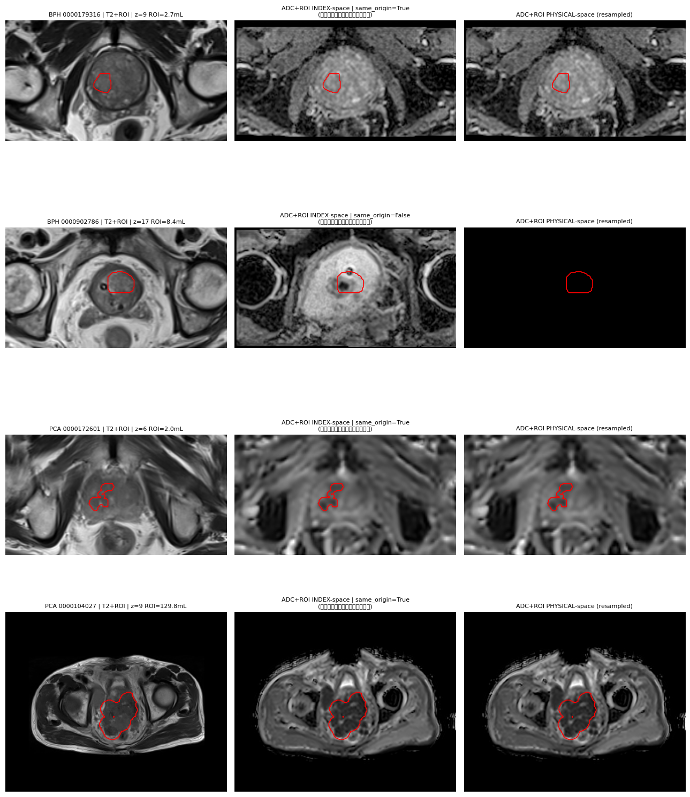

# 前列腺 MRI 数据集分析报告（Data Analysis）

> 数据根目录：`/opt/data/private/lm/data/Prostate`
> 分析环境：conda `lm`（Python 3.10.6 · nibabel 5.4.0 · SimpleITK 2.5.3 · numpy 2.2.6 · pandas 2.3.3 · scipy 1.15.3）
> 分析方式：只读检查（文件清点 + NIfTI/MHA 头信息全量/抽样解析 + 体素与标签统计 + 临床表解析），未修改任何原始数据。
> 复现脚本：`/opt/data/private/lm/my-projects/scripts/`（见文末附录）。
>
> **历史说明（2026-09-15；research_plan v2.1/v2.2 覆盖）**：本文件的数据事实（规模、模态构成、几何审计、
> 标签语义、强度属性与质量结论）**仍然有效，可被正式文档与审计引用**；但其中两处**研究方向建议已被研究
> 计划 v2.1/v2.2 正式取消**，仅作历史候选方向保留、不得据此实施：(1) §5 第 9 条中“以域适应缓解扫描仪差异”
> 的表述；(2) §6 表格中“跨数据集泛化/域适应（leave-one-center-out）”一行。当前主线**不做** LOCO、域随机化、
> 域适应模块或域泛化声明；外部数据仅在 G0-E 审计通过后作**冻结后的最终测试**（见 `docs/research_plan.md`
> §0.3/§5.2 与 `docs/protocols/G0_E_INDEPENDENT_TEST.md`）。

本报告覆盖 **2 个私有数据集**（`BPH`、`PCA`）与 **3 个公开数据集**（`MSD_Prostate`、`PI-CAI`、`Prostate158`），共约 **34 GB**、**约 2100+ 例**前列腺多参数 MRI（mpMRI）数据，从数据规模、模态构成、标注语义、影像物理属性、数据质量与预处理需求等维度进行系统分析。

---

## 1. 总览

### 1.1 数据集对比总表

| 数据集 | 类型 | 规模 | 影像模态 | 标注内容 | 核心任务 | 格式 | 磁盘 |
|:--|:--|:--|:--|:--|:--|:--|:--|
| **BPH** | 私有 | 179 例 | ADC / DWI / T2 | `ROI.nii` 二值 ROI（**语义待确认**，无病理/标注文档） | 分组=良性；ROI 病灶语义未证实 | `.nii`（未压缩） | 868 M |
| **PCA** | 私有 | 182 例 | ADC / DWI / T2 | `ROI.nii` 二值 ROI（**语义待确认**，无病理/标注文档） | 分组=恶性；ROI 病灶语义未证实 | `.nii`（未压缩） | 995 M |
| **MSD_Prostate** | 公开 | 32 训练 + 16 测试 | T2 + ADC（4D 双通道） | 分区标签 `{0,1,2}` = 背景/PZ/TZ | 前列腺**分区（zonal）解剖分割** | `.nii.gz` | 458 M |
| **PI-CAI** | 公开 | 1476 患者 / 1500 study | T2W / ADC / HBV /（cor / sag） | csPCa 病灶（ISUP 2–5）+ 腺体 + 分区 + 临床表 | **临床显著前列腺癌（csPCa）检测/分割** | `.mha`（影像）+ `.nii.gz`（标签） | 26 G |
| **Prostate158** | 公开 | 158 例（139 train + 19 test） | T2 / ADC / DWI | 解剖分区 + 肿瘤（**双阅片者** reader1/2） | 病灶分割 · 分区分割 · 阅片者一致性 | `.nii.gz` | 5.6 G |

### 1.2 关键差异速览

- **任务语义分两类**：
  - **病灶级（lesion）**：`BPH`、`PCA`、`PI-CAI`、`Prostate158`（tumor 标注）——目标是勾画/检出前列腺内的病灶。
  - **解剖分区级（zonal / gland）**：`MSD_Prostate`、`PI-CAI`（whole_gland / zonal_pz_tz）、`Prostate158`（anatomy 标注）——目标是分割前列腺腺体及外周带（PZ）/移行带（TZ）。
- **模态齐全度**：`PI-CAI`（含高 b 值 DWI/HBV + 冠状/矢状重建）与 `Prostate158`/私有数据（T2+ADC+DWI）较全；`MSD_Prostate` 仅 T2+ADC 双通道。
- **标注权威度**：公开数据集均带官方标签映射（PI-CAI 有 README/marksheet、MSD 有 dataset.json、Prostate158 有 CSV）；私有 `BPH`/`PCA` **无任何元数据文件**，其语义由本次分析实测推断（见 §2）。

> ⚠️ **跨数据集陷阱**：各数据集**标签整数值语义不一致**（如 `{0,1,2}` 在 MSD 是 背景/PZ/TZ，在 PI-CAI zonal 是 背景/两分区，在私有 ROI 中仅 `{0,1}`；PI-CAI 病灶用 ISUP 值 `2–5`，Prostate158 的 t2_tumor 实测前景值为 `3`）。**合并训练前必须逐数据集重映射标签，切勿按数值直接拼接。**

---

## 2. 私有数据集（BPH / PCA）

私有数据来自同一编号体系（病例目录名为 10 位补零流水号），按病理性质拆分为 **BPH（良性前列腺增生，Benign Prostatic Hyperplasia）** 与 **PCA（前列腺癌，Prostate Cancer）** 两组，天然构成一组 **良 vs 恶鉴别诊断** 的对照队列。

### 2.1 目录与文件结构

```
Prostate/
├── BPH/<病例ID>/           # 179 个病例目录，ID 范围 0000000441 ~ 0001010008
│   ├── ADC.nii             # 表观扩散系数图
│   ├── DWI.nii             # 弥散加权像
│   ├── T2_not_fs.nii       # T2 加权像（not_fs = 非脂肪抑制）
│   └── ROI.nii             # 二值感兴趣区 ROI（语义待确认，非经证实的金标准）
├── PCA/<病例ID>/           # 182 个病例目录，ID 范围 0000004975 ~ 0001018026
│   └── （同上 4 个文件）
└── .research_private/uid_key.txt   # 受保护文件（权限 600），本分析未读取
```

- **完整性极佳**：`BPH` 179 例、`PCA` 182 例，**每例都严格包含 4 个 `.nii` 文件**，无缺失、无多余文件。
- **同例内四模态数组网格一致，但不等于“已配准”**：实测同例内 ADC/DWI/T2/ROI 的**数组尺寸**完全一致（BPH 179/179、PCA 182/182），但这仅说明网格尺寸相同，**不足以判定配准**。进一步核对几何五元组（size / spacing / origin / direction / physical extent）：`PCA` **182/182** 例五项全一致；`BPH` **178/179** 例全一致，**1 例（`0000902786`）的 `T2_not_fs`/`ROI` 相对 `ADC`/`DWI` 存在 origin 偏移 ≈ [-13.2, -5.1, -81.0] mm**（z 向错位约 27 层），属**真实配准异常，须单独修复**。即便五项一致也只能称“**同一物理网格**”，**不能证明不同序列间无残余运动/形变错位**（头信息无法反映序列间运动），须叠加可视化 QC（见 §2.5）。
- **无元数据**：两组均**不含任何 csv/json/txt** 临床或标签说明文件，病例分组（BPH/PCA）即隐含的病例级诊断标签。

### 2.2 影像物理属性

| 属性 | BPH（179 例） | PCA（182 例） |
|:--|:--|:--|
| 主要矩阵尺寸(size) | (220,120,23) 89 例 · (220,120,20) 57 例 · (220,220,23) 18 例 · (256,208,20) 5 例 · (90,54,20) 5 例 | (220,120,23) 53 例 · (220,120,20) 46 例 · (220,220,23) 29 例 · (256,208,20) 26 例 · (90,54,20) 16 例 |
| 平面内间距 x/y | 0.864 – 2.000 mm | 0.864 – 2.250 mm |
| 层厚 z | 3.0 – 7.2 mm（中位 3.0） | 3.0 – 9.6 mm（中位 4.0） |
| ADC dtype | int16 ×178，**float32 ×1** | int16 ×179，**float32 ×3** |
| DWI dtype | int16 ×179 | int16 ×175，**float32 ×7** |
| T2 dtype | int16 ×179 | int16 ×182 |
| ROI dtype | uint16 ×179 | uint16 ×182 |
| 方向矩阵(direction) | 非单位阵，含轻微旋转（斜扫/倾斜编码） | 同左 |

- **各向异性明显**：层厚（3–9.6 mm）远大于平面内间距（0.86–2.25 mm），是典型临床厚层 MRI；PCA 的尺寸/层厚离散度大于 BPH（来源设备/协议更杂）。
- **数据类型不统一**：绝大多数为 16-bit 整型，但存在少量 `float32` 的 ADC/DWI（BPH 1 个、PCA 10 个），预处理需统一 dtype 与强度标定。
- **强度范围（抽样）**：ADC 均值约 500–1250（max 可达 4095，疑 12-bit 截断）、DWI 均值低（约 9–66，且 PCA 个别 max 高达 3 万）、T2 均值约 300–450。不同模态量纲差异大，**必须分模态独立归一化**。
- **方向矩阵非单位阵**（示例 BPH：`[1,0.01,0; -0.01,0.96,-0.28; 0,0.28,0.96]`，y/z 轴约 16° 倾斜），提示存在斜扫或方向余弦编码，重采样时须携带 direction 信息。

### 2.3 ROI 标签语义（全量实测）

对全部 361 例 `ROI.nii` 逐一体素统计，明确其为**二值掩膜**（标签值仅 `{0,1}`；ROI 语义待确认），且**无一例为空掩膜**（即每例都勾画了某感兴趣区、无阴性对照；该 ROI 是否即病理病灶未经文档证实）：

| ROI 指标 | BPH（179 例） | PCA（182 例） |
|:--|:--|:--|
| 标签值 | `{0, 1}` | `{0, 1}` |
| 空 ROI（前景=0） | 0 例 | 0 例 |
| 前景体素数（中位 / 范围） | 894 / (18 – 9515) | 435 / (22 – 40260) |
| 前景体积 mL（中位） | 2.71 | 2.01 |
| 前景体积 mL（q75 / q90 / max） | 4.38 / 8.22 / **23.59** | 8.20 / 23.17 / **129.81** |
| 连通域数（单 / 多） | 176 单 + 3 双 | 167 单 + 11 双 + 3 三 + 1 四 |

**结论（严格区分实测与推断）：**

1. **实测：ROI 是腺体内的局灶二值区域，而非整腺分割**：前景体积中位仅 2–2.7 mL，远小于成人整腺（30–60 mL）；叠加可视化（§2.5）亦显示中位例 ROI 圈于腺体内部。这与 `PI-CAI` whole_gland（整腺）标签不同。
2. **⚠️ 语义仍不可靠（证据边界）**：私有数据**无随附病理/标注说明文档**，故仅凭文件夹名（BPH/PCA）与体积/形态**不能确认**：① ROI 一定是病理证实病灶；② BPH ROI 更规则 / PCA ROI 更浸润（叠加图仅见个别样本形态差异，样本量不足以统计断言）；③ 私有 PCA 与 PI-CAI 的 csPCa 金标准等价。**因此暂不能把私有 PCA 直接作为 PI-CAI 病灶分割的外部测试集**；文件夹名仅提供病例级诊断先验。
3. **⚠️ 存在异常大 ROI（语义存疑）**：PCA 最大前景体积 **129.8 mL**（例 `0000104027`），已超前列腺整腺典型体积（30–60 mL）上限，**属异常大且语义存疑**；在缺乏可靠整腺（WG）参考或人工复核证据时**不能断言其超出腺体**，**训练/评估前须以 WG 或人工证据核查**，并建议复核体积 > q99 的离群样本。
4. **极端类别不平衡**：病灶体素仅占全图极小比例（前景数百体素 vs 全图数十万体素），训练须采用 patch-based 采样、前景加权损失（如 Dice/Focal）等策略。

### 2.4 数据泄漏核查

- `BPH` 与 `PCA` 的病例**目录 ID 交集为 0**（179 vs 182 目录名无重复）。⚠️ **但目录 ID 无交集不能证明无重复患者**：同一患者可能以不同 ID 出现、或跨 BPH/PCA 重复；在缺少患者级身份映射（如 `.research_private/uid_key.txt`，本分析未读取）的情况下**无法排除重复患者**，划分训练/验证时须以患者为单位并谨慎。
- 两组 ID 同属一个编号区间（`0000000441 ~ 0001018026`）仅为观察，**不足以断言**二者“必然来自同一机构/同一采集系统”或“域偏移较小”（无机构/设备/协议元数据佐证），该结论已删除。

### 2.5 配准核对与叠加可视化（QC）

为验证 §2.1 的“同一物理网格”结论，对同例内 4 模态逐项核对几何五元组，并对代表性病例生成 T2/ADC+ROI 叠加图。叠加图含**物理空间**（ADC 先重采样到 ROI 网格）与 **index 空间**（仅数组空间，仅当同 origin 时等价于物理）两列对照，严禁只按相同数组索引叠加不同网格影像（脚本 `scripts/check_registration.py`、`scripts/overlay_qc.py`）：



- **几何核对结果**：`PCA` 182/182 例 size/spacing/origin/direction/extent 五项全一致；`BPH` 178/179 例全一致，**仅 `0000902786` 的 `T2_not_fs`/`ROI` origin 相对 `ADC`/`DWI` 偏移 ≈ [-13.2, -5.1, -81.0] mm**（叠加图第 2 行可见 T2+ROI 与 ADC+ROI 轮廓错位）。
- **叠加图解读**（4 行 = BPH 中位例 / BPH 异常例 / PCA 中位例 / PCA 异常大例）：中位例 ROI 均为腺体内局灶区域；PCA 中位例形态不规则、BPH 中位例较规则（**仅个别样本，不作统计断言**）；PCA `0000104027`（129.8 mL）ROI 异常大，是否超出腺体需 WG/人工证据确认。
- **结论**：几何五元组一致 ⇒ “同一物理网格”（可按数组索引直接叠加），但**残余运动/形变错位仍须逐例叠加可视化确认**；`0000902786` 类 origin 异常例必须先修复配准再入训。

---

## 3. 公开数据集

### 3.1 MSD_Prostate（Medical Segmentation Decathlon · Task05）

来源 Radboud University Nijmegen Medical Centre，许可 **CC-BY-SA 4.0**；任务为**前列腺分区（zonal）分割**，规模小、结构规整，常用作分割算法的基准/预训练。

- **目录**：`Task05_Prostate/{imagesTr, labelsTr, imagesTs}` + `dataset.json`（另有 `.tar` 原始压缩包与 macOS 的 `._*` 冗余文件，可忽略）。
- **规模**：`imagesTr` = 32、`labelsTr` = 32、`imagesTs` = 16（测试集无标签）。`dataset.json` 声明 `numTraining=32, numTest=16`，与实测一致。
- **影像为 4D 双通道**：单文件即含 T2 与 ADC 两个模态，`size=(320,320,15,2)`、`spacing=(0.6,0.6,4.0)`、`dtype=float32`；读入数组形状 `(2, D, H, W)`，**通道 0 = T2、通道 1 = ADC**（实测通道 0 max≈1486、通道 1 max≈3619）。
- **标签语义（`dataset.json` 权威）**：`{0: background, 1: PZ（外周带）, 2: TZ（移行带）}`。实测标签体积符合解剖——TZ(值2) 体素通常多于 PZ(值1)（如 prostate_39：PZ=5229、TZ=34938）。
- **注意**：各例矩阵/层数不完全相同（层厚 4 mm、平面内 0.6 mm 为主），且**测试集 16 例无金标准**，本地评估需用训练集自行划分或提交官方服务器。

### 3.2 PI-CAI（PI-CAI Challenge · 公开训练/开发集）

来源 RUMC 等，许可 **CC BY-NC 4.0**，参考 Saha et al., *Lancet Oncol* 2024。是**规模最大、标注最丰富**的数据集（磁盘 26 G），面向 **csPCa（临床显著前列腺癌，ISUP ≥ 2）自动检测/分割**。

**（1）规模与组织**

- `images/`：**1476 个患者目录**，含 **1500 个 study**（少数患者有多次检查，如 `11054` 有 `1001074`/`1001075` 两次），study 以 `<patient>_<study>` 命名。
- `labels/`：一个独立 **Git 仓库**（`picai_labels`），含 `README.md`、`LICENSE`、临床信息与多来源标注。

**（2）影像模态（`.mha`，均 16-bit）**

| 模态 | 含义 | 文件数 | 典型平面内间距 | 典型矩阵 |
|:--|:--|:--|:--|:--|
| `t2w` | 轴位 T2 加权 | 1500 | 0.30 – 0.625 mm（高分辨） | (320,320,D) / (384,384,D) / (640,640,D) |
| `adc` | 表观扩散系数 | 1500 | 0.86 – 2.51 mm（低分辨） | (70,102,D) – (256,256,D) |
| `hbv` | 高 b 值 DWI | 1500 | 0.86 – 2.51 mm（低分辨） | 同 adc |
| `cor` | 冠状位 T2 重建 | **1497** | 0.56 – 0.6 mm | (320,320,D) / (384,384,D) |
| `sag` | 矢状位 T2 重建 | **1498** | 0.56 – 0.6 mm | (320,320,D) |

> **关键点**：`t2w` 与 `adc/hbv` 的**原始采样网格不同**（T2 高分辨、扩散像低分辨，平面内间距差 4–8 倍；层厚一致）——这是**采样网格差异，并非“未配准”**；多模态融合前须在**物理坐标下统一重采样**到参考空间（官方因此额外提供 `resampled` 标签），并**评估重采样后的残余错位**；`cor`/`sag` 为可选重建，**存在少量缺失**（3 / 2 个）。

**（3）多层级标签体系（实测唯一值）**

| 标签路径 | 文件数 | 实测标签值 | 语义 |
|:--|:--|:--|:--|
| `csPCa_lesion_delineations/human_expert/original` | 1295 | `{0,2,3,4,5}` | 专家病灶勾画，**多类 ISUP 分级**（原始分辨率，可能建在 T2 或 ADC/DWI 空间） |
| `csPCa_lesion_delineations/human_expert/resampled` | 1295 | `{0,2,3,4,5}` | 同上，**重采样到轴位 T2 空间**（推荐用于训练） |
| `csPCa_lesion_delineations/human_expert/Pooch25` | 205 | `{0,1}` | 2025 新增：对既往仅 AI 标注的 205 个阳性例补充**专家二值**标注 |
| `csPCa_lesion_delineations/AI/Bosma22a` | 1500 | `{0,1}` | AI 自动病灶**二值**标注（覆盖全部 1500 例） |
| `anatomical_delineations/whole_gland/AI/Bosma22b` | 1500 | `{0,1}` | AI 自动**前列腺整腺**分割（每例均有前景） |
| `anatomical_delineations/zonal_pz_tz/AI/Yuan23` | 1500 | `{0,1,2}` | AI **分区**分割，算法一；**0=bg, 1=PZ, 2=TZ**（README 明确） |
| `anatomical_delineations/zonal_pz_tz/AI/HeviAI23` | 1500 | `{0,1,2}` | AI **分区**分割，算法二；**0=bg, 1=PZ, 2=TZ**（README 明确） |

- **专家病灶标注构成与合并规则**：1500 例的专家级参考标签由三部分构成——**1075 个阴性空标签** + **220 个原有专家阳性标注**（`human_expert/original` 中非空者，original 共覆盖 1295 例）+ **205 个 `Pooch25` 新增专家阳性标注**（1075+220+205=1500）。实测 original 阳性率低（抽样 60 例中 9 例 ≈ 15%，与 220/1295 ≈ 17% 吻合）。**合并时须将 `original` 的多类标签值 `2–5` 与 `Pooch25` 的二值标签值 `1` 统一映射为病灶前景（二值化）**，阴性例保持空标签，方可得到覆盖全部 1500 例的专家级病灶参考。
- **ISUP → 标签值映射**：`0`=ISUP≤1（阴性/惰性）、`2/3/4/5`=对应 ISUP 分级；AI 标注为二值（`1`=ISUP≥2）。

**（4）临床信息 `clinical_information/marksheet.csv`（1500 行，实测统计）**

| 维度 | 分布 |
|:--|:--|
| csPCa 病例级（`case_csPCa`） | **阴性 NO = 1075（71.7%）**，**阳性 YES = 425（28.3%）** |
| 采集中心（`center`） | RUMC = 800，PCNN = 350，ZGT = 350（**多中心**） |
| 病理采样（`histopath_type`） | MRBx=549、SysBx=217、SysBx+MRBx=210、RP=25、未采样(阴性)=499 |
| 病例 ISUP（`case_ISUP`） | 0=847，1=228，2=234，3=99，4=40，5=52 |
| 年龄（岁） | 中位 66（IQR 61–70，范围 35–92） |
| PSA（ng/mL） | 中位 8.5（IQR 5.9–13.0，范围 0.1–224；缺失 40） |
| 前列腺体积（mL） | 中位 57（IQR 40–80，范围 4–308；缺失 27） |
| PSA 密度 PSAd | 中位 0.14（缺失 451） |

- **临床指标具判别力**：csPCa 阳性组 vs 阴性组中位数——年龄 68 vs 65、PSA 10.0 vs 7.85、体积 48 vs 61、**PSAd 0.22 vs 0.12**；PSAd（PSA/体积）差异最显著，是重要的辅助特征。
- **数据缺失**：`psad`(451)、`psa`(40)、`prostate_volume`(27) 存在缺失，建模时需处理。
- `additional_resources/ProstateX-mapping.json`：提供与 **ProstateX** 的病例映射（PI-CAI 含 328 例 ProstateX）——**官方建议二选一使用，避免与 ProstateX 重复导致数据泄漏**。

### 3.3 Prostate158

公开的前列腺 mpMRI 分割/检测数据集，共 **158 例**（数据集名即源于例数），特色是**双阅片者（reader1/reader2）标注**并提供**阅片者间一致性**指标，文献中常与 PROMISE12 并列用作前列腺分割基准；其标注约定（`empty` 阴性占位、tumor 用高值 `3`、anatomy 三分值）与 ProstateX/PI-CAI 体系一致，适合分割 + 标注不确定性研究。

- **划分**：`train/`（139 例：`train.csv` 119 + `valid.csv` 20）、`test/`（19 例：`test.csv`）；`interrater.csv` 给出 test 集 reader1/2 的一致性。
- **影像模态（`.nii.gz`，float32）**：每例含 `t2`/`adc`/`dwi` 三模态（各 158 个），层厚统一约 3 mm，但矩阵尺寸多样（如 (270,270,D)、(442,442,D)）。
- **标注文件（实测出现次数）**：

| 标注 | 文件数 | 实测标签值 | 语义 |
|:--|:--|:--|:--|
| `t2_anatomy_reader1` | 158 | `{0,1,2}` | T2 上的**解剖分区**（背景 + PZ/TZ 两分区，标签1为主体区） |
| `t2_anatomy_reader2` | 19 | `{0,1,2}` | 仅 test 集提供第二阅片者分区 |
| `t2_tumor_reader1` | 101 | `{0,3}`（实测） | T2 上的**肿瘤**掩膜（reader1） |
| `adc_tumor_reader1` | 102 | `{0,1}` | ADC 上的肿瘤掩膜（reader1） |
| `adc_tumor_reader2` | 86 | `{0,1}` | ADC 上的肿瘤掩膜（reader2） |
| `empty.nii.gz` | 56 | 全 0 | **阴性占位**（该阅片者无肿瘤勾画时 CSV 指向它） |

- **阳性/阴性**：约 **102 例含肿瘤标注（阳性）**、**56 例以 `empty` 占位（阴性）**（102+56=158），可作为病灶检测的病例级标签。
- **阅片者间一致性（`interrater.csv`）**：对 test 19 例给出 TZ/PZ/肿瘤（tu）的 **Dice、Hausdorff、表面距离**及两阅片者各自体积，例如 TZ 的 Dice 多在 0.83–0.93，而肿瘤（tu）Dice 波动大（0.0–0.91）——**反映病灶勾画的阅片者间差异显著大于分区勾画**，可作为标注不确定性/鲁棒性评估基线。
- **CSV 索引**：`train.csv`/`valid.csv`/`test.csv` 以相对路径列出每例各模态与各标注文件，**注意阴性例的 tumor 列为空或指向 `empty.nii.gz`**，加载时需容错。

---

## 4. 横向对比分析

### 4.1 模态构成对比

| 数据集 | T2 | ADC | DWI | 高 b 值(HBV) | 冠/矢状重建 | 模态数 |
|:--|:--:|:--:|:--:|:--:|:--:|:--:|
| BPH | ✓（T2_not_fs） | ✓ | ✓ | ✗ | ✗ | 3 |
| PCA | ✓（T2_not_fs） | ✓ | ✓ | ✗ | ✗ | 3 |
| MSD_Prostate | ✓（通道0） | ✓（通道1） | ✗ | ✗ | ✗ | 2 |
| PI-CAI | ✓（t2w） | ✓ | — | ✓（hbv） | ✓（cor/sag） | 3–5 |
| Prostate158 | ✓ | ✓ | ✓ | ✗ | ✗ | 3 |

- **共有核心三模态**：T2 + ADC + DWI 是大多数数据集的公约数（PI-CAI 的 `hbv` 即高 b 值 DWI），可作为**跨数据集统一的最小模态集**；PI-CAI 的 `cor/sag` 与 MSD 的双通道封装为特有形式。

### 4.2 分辨率与格式对比

| 数据集 | 格式 | 典型平面内间距 | 典型层厚 | 主 dtype | 多模态配准 |
|:--|:--|:--|:--|:--|:--|
| BPH/PCA | `.nii`（未压缩） | 0.86–2.25 mm | 3.0–9.6 mm | int16（少量 float32） | 同一物理网格（五元组一致；BPH 1 例 origin 异常） |
| MSD_Prostate | `.nii.gz` | 0.6 mm | 4.0 mm | float32 | ✓（4D 封装） |
| PI-CAI | `.mha` | T2 0.3–0.63 / ADC·HBV 0.86–2.51 mm | 3.0–4.0 mm | 16-bit | 原始采样网格不同，需物理坐标重采样 |
| Prostate158 | `.nii.gz` | 多样 | ~3.0 mm | float32 | ✓（同尺寸） |

- **各向异性普遍**：所有数据集层厚（3–9.6 mm）均显著大于平面内间距，属临床厚层扫描；2D 切片模型或各向异性重采样需纳入考量。
- **PI-CAI 各模态原始采样网格不同**最突出（T2 与 ADC/HBV 平面内差 4–8 倍）：这是**采样网格差异而非“未配准”**，融合前须在物理坐标下统一重采样并评估残余错位。

### 4.3 标注语义对比

| 数据集 | 病灶掩膜 | 整腺分割 | 分区(PZ/TZ) | 分级信息 | 多阅片者 | 临床表 |
|:--|:--:|:--:|:--:|:--:|:--:|:--:|
| BPH | ✓（二值） | ✗ | ✗ | ✗（组=良性） | ✗ | ✗ |
| PCA | ✓（二值） | ✗ | ✗ | ✗（组=恶性） | ✗ | ✗ |
| MSD_Prostate | ✗ | ✗ | ✓ `{0,1,2}` | ✗ | ✗ | ✗ |
| PI-CAI | ✓（ISUP 2–5 / 二值） | ✓ `{0,1}` | ✓ `{0,1,2}` | ✓（ISUP/GS） | 部分（AI+专家） | ✓ |
| Prostate158 | ✓（tumor） | ✗ | ✓ `{0,1,2}` | ✗ | ✓（reader1/2） | 部分（interrater） |

- **病灶标签值不统一**：PI-CAI 专家用 ISUP `2–5`（多类）、AI 用 `0/1`；Prostate158 tumor 实测前景 `1`（adc）或 `3`（t2）；私有 BPH/PCA 用 `0/1`。统一训练时需**二值化或按约定重映射**。
- **分区标签映射**：MSD `{0,1,2}=bg/PZ/TZ`（dataset.json 权威）；PI-CAI zonal `{0,1,2}=bg/PZ/TZ`（Yuan23/HeviAI23 两套 README 均明确 1=PZ、2=TZ）——**两者映射已确定、可直接对齐**。**仅 Prostate158 的 `t2_anatomy` 1/2 与 PZ/TZ 对应未随附权威定义**（实测标签1为主体区），合并前须核对官方说明。

---

## 5. 数据质量与预处理建议

面向后续建模（分割/检测/良恶性鉴别），给出基于实测结果的具体预处理与质量管控要点：

1. **统一重采样**：各数据集/各模态 spacing/采样网格不一（尤其 PI-CAI T2 vs ADC 原始网格不同），须在**物理坐标下**重采样到统一各向同性或固定平面内间距 + 层厚，并**评估残余错位**；重采样时**携带 direction**（私有数据方向矩阵非单位阵、含斜扫）；标签用最近邻、影像用线性/样条插值；**先修复 BPH `0000902786` 类 origin 异常例**再入训。
2. **dtype 与强度归一化**：先统一 dtype（存在 int16/float32/uint16 混合）；再**分模态独立归一化**（ADC/DWI/T2 量纲差异大，ADC 可见 4095 截断、DWI 个别 max 达 3 万）；推荐 z-score 或百分位裁剪 + 归一化，避免异常值主导。
3. **朝向/左右一致性**：统一 direction 到同一约定（如 LPS/RAS），必要时左右翻转增强；注意 NIfTI 与 MHA 的轴序差异（SimpleITK size=(x,y,z) vs 数组=(z,y,x)）。
4. **极端类别不平衡**：病灶/腺体前景占比极小（私有 ROI 前景中位仅数百体素、PI-CAI 阳性率仅 ~17–28%），建议 **patch-based 采样（前景过采样）+ Dice/Focal/Tversky 等加权损失**。
5. **缺失与占位处理**：PI-CAI `cor/sag` 少量缺失、`psad/psa/volume` 临床缺失；Prostate158 阴性例 tumor 指向 `empty.nii.gz`；PI-CAI 205 例需 `original+Pooch25` 合并才完整——加载器需**显式容错**。
6. **离群样本核查**：私有 PCA 存在 ROI 体积达 **129.8 mL** 的异常大掩膜（超整腺典型上限、语义存疑），须以整腺（WG）或人工证据复核、并复核体积 > q99 的离群样本后再决定是否入训。
7. **标签重映射（关键）**：跨数据集合并前，**逐数据集**将标签值映射到统一 schema（病灶: 0/1，其中 PI-CAI 须将 original 的 `2–5` 与 Pooch25 的 `1` 二值化；分区: 0=bg,1=PZ,2=TZ，与 MSD/PI-CAI 官方一致），切勿按原始整数直接拼接；Prostate158 分区 1/2 对应须先核对官方。
8. **数据泄漏防范**：PI-CAI 含 328 例 ProstateX（`ProstateX-mapping.json`），**PI-CAI 与 ProstateX 二选一**；私有 BPH/PCA 与公开集按患者/study 级别划分 train/val/test，避免同一患者跨集。
9. **（历史候选方向，已被 v2.1/v2.2 覆盖；不得据此引入域适应模块）域偏移与泛化**：公开集 PI-CAI 来自多中心/多扫描仪（3 中心、5S/2P）；**私有集的具体机构/设备来源无元数据可考，“来自单一机构”仅为推测**，实际域偏移程度未知。原文曾建议以**强度标准化/域适应**缓解可能的扫描仪差异并在结果中标注域偏移假设的不确定性——**该方向已不属于当前研究主线**（不做域适应、域随机化或 LOCO；外部数据只作冻结后的最终测试，不作域泛化声明）；本条仅作为数据事实与历史建议记录。

---

## 6. 面向研究的适用性

基于以上分析，该数据组合可支撑以下研究方向：

| 研究方向 | 可用数据 | 说明 |
|:--|:--|:--|
| **良恶性鉴别（BPH vs PCA）** | 私有 BPH(179) + PCA(182)，共 361 例 | 分组提供病例级良/恶先验（361 例）；**目录 ID 无交集≠无重复患者，且不能证实 ROI 语义**，仅可作探索性二分类队列，结论需待标注语义确认 |
| **csPCa 病灶检测/分割** | PI-CAI(1500, ISUP分级) + Prostate158(tumor)；私有 PCA(182) 暂仅作院内独立队列 | PI-CAI 提供大规模专家/AI 标注与临床特征；**私有 PCA 只有在标注协议与临床语义经确认并与 PI-CAI 对齐后，才能作为其外部测试集；当前不能直接用作 csPCa 外部金标准**（见 §2.3） |
| **腺体/分区解剖分割** | MSD(32) + PI-CAI(whole_gland/zonal, 1500) + Prostate158(anatomy) | MSD 可快速基准；PI-CAI zonal 提供两套 AI 分区；可做腺体定位→病灶检测的级联 |
| **（历史候选方向，已取消）跨数据集泛化/域适应** | 公开多中心（PI-CAI 3 中心）→ 未见中心/外部集 | **不属于当前主线（v2.1/v2.2 取消 LOCO 与域泛化）**；外部数据仅在 G0-E 审计通过后作冻结后的最终测试，不设 held-out center、不作域泛化声明 |
| **标注不确定性/鲁棒性** | Prostate158(reader1/2 + interrater) | 双阅片者勾画与一致性指标可评估模型对人类标注差异的鲁棒性 |
| **影像-临床多模态融合** | PI-CAI(影像 + marksheet 临床) | PSAd/PSA/年龄/体积可作辅助特征，与影像融合提升 csPCa 判别 |

**规模汇总**：私有 361 例（BPH 179 + PCA 182）+ 公开约 1706 例（PI-CAI 1500 study + Prostate158 158 + MSD 48），合计约 **2067 例/study**；其中具备**病灶级标注**的约 361（私有，语义待确认）+ 425 阳性（PI-CAI，专家级）+ 102（Prostate158，阅片者级）。

---

## 附录

### A. 术语表

| 缩写 | 全称 / 含义 |
|:--|:--|
| BPH | Benign Prostatic Hyperplasia，良性前列腺增生 |
| PCA / PCa | Prostate Cancer，前列腺癌 |
| csPCa | clinically significant PCa，临床显著前列腺癌（ISUP ≥ 2） |
| T2 / T2W | T2 加权成像（`not_fs` = 非脂肪抑制） |
| ADC | Apparent Diffusion Coefficient，表观扩散系数图 |
| DWI / HBV | 弥散加权成像 / 高 b 值 DWI |
| PZ / TZ | Peripheral Zone 外周带 / Transition Zone 移行带 |
| ISUP | 前列腺癌 Gleason 分级分组（1–5） |
| GS | Gleason Score，格里森评分 |
| PSA / PSAd | 前列腺特异性抗原 / 其密度（PSA÷体积） |
| ROI | Region of Interest，本文私有数据中指二值病灶掩膜 |
| study | 一次 MRI 检查（同一患者可有多次） |

### B. 分析脚本（可复现）

均位于 `/opt/data/private/lm/my-projects/scripts/`，使用 `lm` 环境运行：

| 脚本 | 作用 |
|:--|:--|
| `analyze_picai_clinical.py` | PI-CAI `marksheet.csv` 临床统计（csPCa/中心/PSA/年龄/ISUP/分组对比） |
| `analyze_private.py` | BPH/PCA 影像头信息（全量）+ 强度/ROI 抽样体素统计 |
| `analyze_private_roi.py` | BPH/PCA 全量 ROI 前景体积/连通域/dtype 一致性分析 |
| `analyze_public_msd_p158.py` | MSD 4D 双通道与标签、Prostate158 模态/标注/阳性阴性统计 |
| `analyze_picai_images.py` | PI-CAI 影像（.mha）分辨率与多层级标签唯一值分析 |
| `check_registration.py` | BPH/PCA 同例 4 模态几何五元组（size/spacing/origin/direction/extent）一致性核对，定位配准异常例 |
| `overlay_qc.py` | 生成 T2/ADC + ROI 轮廓叠加图（`docs/figures/registration_overlay_qc.png`），可视化核对配准与 ROI 位置 |

运行示例：`/root/anaconda3/envs/lm/bin/python scripts/analyze_private_roi.py`

### C. 统计口径说明

- **全量统计**：病例数、文件数、dtype 分布、BPH/PCA 的 ROI 前景体积/连通域、PI-CAI `marksheet.csv` 临床指标——基于全部文件。
- **抽样统计**：影像强度范围、spacing/size 分布、标签唯一值——基于随机抽样（`random.seed(0)`，每类 4–12 个），用于代表整体取值范围；PI-CAI 病灶阳性率另抽样 60 例验证（≈ 15%，与官方 17% 吻合）。
- **未读取项**：`.research_private/uid_key.txt`（权限 600，隐私敏感）；各数据集原始体素未作修改。
- 若需**全量 spacing/强度/病灶体积分布**的精确统计（而非抽样），可在 `lm` 环境扩展上述脚本的抽样为遍历（预计耗时数十分钟量级，属只读操作）。
