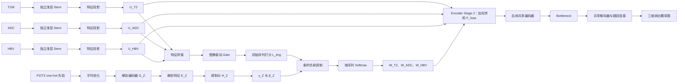

# 基于解剖分区条件自适应多序列融合的前列腺癌病灶分割

## 通俗原理说明

> 英文名称：Anatomy-Conditioned Adaptive Multi-sequence Fusion for Prostate Cancer Lesion Segmentation  
> 本文只解释研究目的、研究方向、解决方法、模型结构和方法创新，不涉及数据划分、训练进度、评价指标或实验结果。

---

## 1. 一句话理解这项研究

这项研究希望让模型在分割前列腺癌病灶时，不是把 T2W、ADC、HBV 三种 MRI 序列简单地混在一起，而是先参考病灶附近属于前列腺外周带（PZ）还是移行带（TZ），再决定当前位置应该更多参考哪一种序列。

可以把它理解成：

> 三位医生分别阅读 T2W、ADC 和 HBV，模型先根据三位医生当前看到的影像内容形成一个初步意见，再根据病灶所在的解剖区域调整三位医生的发言权，最后综合他们的意见进行病灶分割。

这里的“发言权”是连续变化的软权重，不是简单地指定“某个区域只能看某一种序列”。

---

## 2. 研究要解决什么问题

### 2.1 输入和输出

模型接收三种前列腺 MRI 序列：

- **T2W**：主要提供清晰的解剖结构信息；
- **ADC**：反映水分子扩散受限情况；
- **HBV**：高 b 值弥散加权图像，可突出部分可疑病灶；
- **PZ/TZ 解剖先验**：告诉模型各个位置大致属于外周带还是移行带。

模型最终输出一张三维病灶概率图。图中每个位置都有一个概率值，表示该位置属于前列腺癌病灶的可能性。

### 2.2 为什么不能只做通道拼接

最简单的多序列方法，是把 T2W、ADC、HBV 当成三个输入通道，直接交给同一个网络处理。这种方式容易实现，但它没有明确回答一个问题：

> 在当前这个位置，三种序列分别应该占多大权重？

不同 MRI 序列提供的信息并不完全相同，而且同一种序列在不同解剖区域中的作用也可能不同。因此，本研究希望模型能够学习“因位置而异”的序列组合，而不是在所有位置使用同一种融合方式。

### 2.3 为什么还要加入 PZ/TZ

仅根据影像内容生成动态权重，虽然比普通拼接更灵活，但模型并不知道当前位置属于哪个前列腺解剖区域。

PZ 和 TZ 能够提供一种额外的空间背景：

- 当前特征来自哪个解剖区域；
- 当前点是否位于两个分区的交界附近；
- 同一种影像表现是否应在不同区域采用不同的融合方式。

因此，本研究不是简单地“给网络多加两个通道”，而是让 PZ/TZ 信息直接参与三种序列权重的计算。

---

## 3. 研究方向

本研究的核心方向是：

> **解剖分区条件下的空间自适应多序列融合。**

其中包含三个关键词。

### 3.1 多序列融合

联合使用 T2W、ADC 和 HBV，让不同序列提供互补信息。

### 3.2 空间自适应

模型不是为整幅图像生成三个固定权重，而是为每个空间位置分别生成权重。因此，在不同位置可能出现不同的序列组合。

例如：

- 位置 A 的权重可能是 T2W 0.50、ADC 0.30、HBV 0.20；
- 位置 B 的权重可能是 T2W 0.20、ADC 0.35、HBV 0.45。

这些数值只是说明“权重会随位置变化”，不是预先规定的实际权重。

### 3.3 解剖条件

序列权重不仅由影像特征决定，还会受到 PZ/TZ 解剖先验的调节。

这里的“条件”可以理解为：

> 在作出融合决定时，模型除了看“这里长什么样”，还要知道“这里位于什么解剖区域”。

---

## 4. 模型整体结构

模型由五个主要部分组成。

### 4.1 三条浅层影像分支

T2W、ADC、HBV 首先分别进入自己的浅层特征提取模块。三条分支的结构相同，但参数彼此独立。

这样设计的原因是，三种 MRI 序列的图像含义和强度分布不同。如果一开始就完全共用参数，网络可能难以分别学习各个序列的特点。

### 4.2 共同特征空间

三条分支提取特征后，还要分别经过一个特征投影模块，将它们变换到相同的通道数量和特征尺度。

这一步类似于让三位使用不同术语的医生，先把意见翻译成同一种表达方式，然后再比较和融合。

### 4.3 图像驱动 Gate

模型将三个序列的特征放在一起，根据局部影像内容产生三个初始分数。这些分数反映模型在没有使用解剖条件修正之前，对三个序列的初步偏好。

### 4.4 解剖条件分支

PZ/TZ 先验经过尺度匹配和轻量编码，生成两组调制参数：`γ_Z` 和 `β_Z`。

它们不直接替代三种影像，也不直接给出病灶结果，而是负责调整图像驱动 Gate 的初始分数。

### 4.5 加权融合与共享分割网络

经过解剖调制后，三个序列分数通过 Softmax 转换为权重。模型使用这些权重对三种序列特征进行加权求和，再将融合特征送入后续共享编码器和解码器，最终输出三维病灶概率图。

---

## 5. 公式逐步解释

### 5.1 第一步：分别提取三种序列的特征

公式为：

$$
F_m=S_m(X_m),\qquad m\in\{T2,ADC,HBV\}.
$$

#### 每个符号是什么意思

- $m$：当前处理的是哪一种 MRI 序列；
- $X_m$：第 $m$ 种序列的输入图像；
- $S_m$：第 $m$ 种序列自己的浅层特征提取模块；
- $F_m$：从该序列中提取出的浅层特征。

#### 通俗解释

三种图像分别交给三个“专科观察员”：

- T2W 观察员专门学习 T2W 的表现；
- ADC 观察员专门学习 ADC 的表现；
- HBV 观察员专门学习 HBV 的表现。

它们的工作方式相似，但各自拥有独立参数，因而可以学习不同序列的特点。

---

### 5.2 第二步：把特征转换到共同空间

公式为：

$$
U_m=P_m(F_m).
$$

其中：

- $P_m$：第 $m$ 个序列的特征投影模块；
- $F_m$：投影前的序列特征；
- $U_m$：进入融合模块的统一形式特征。

#### 为什么需要投影

如果三种特征的通道数、数值范围或表达方式不同，直接比较权重可能不公平。某一路特征数值更大，并不一定说明它更重要，却可能在融合时占据优势。

因此，投影模块的作用是：

1. 统一特征通道；
2. 调整特征尺度；
3. 减少因特征数值范围不同产生的伪权重。

可以把它理解为：先统一三位医生的评分标准，再对他们的意见进行加权。

---

### 5.3 第三步：根据影像内容生成初始序列分数

公式为：

$$
L^{img}=G_{img}([U_{T2},U_{ADC},U_{HBV}]).
$$

其中：

- $[\cdot]$：把三种特征沿通道方向拼接；
- $G_{img}$：图像驱动的空间 Gate；
- $L^{img}$：三个序列的初始 logits，也就是未经解剖条件修正的原始分数。

#### 什么是 logit

Logit 可以简单理解成“还没有归一化的评分”。它不是概率，也不要求三个值相加等于 1。

例如，某个位置的初始分数可能为：

$$
L^{img}=[1.0,\ 0.5,\ 0.0].
$$

它表示在只看影像内容时，模型当前更偏向 T2W，其次是 ADC，最后是 HBV。但这还不是最终权重。

#### 为什么先生成初始分数

本研究并不希望用解剖先验完全接管融合决策。模型应当先根据真实影像内容形成自己的判断，然后由解剖信息进行有界、连续的调整。

---

### 5.4 第四步：编码 PZ/TZ 解剖先验

首先将解剖先验缩小到与融合特征相同的空间尺度：

$$
\widetilde Z=\operatorname{AvgPool}(Z).
$$

然后提取解剖特征：

$$
E_Z=G_Z(\widetilde Z).
$$

其中：

- $Z$：原始 PZ/TZ one-hot 解剖先验；
- $\widetilde Z$：经过平均池化后，与影像特征尺度匹配的分区信息；
- $G_Z$：轻量解剖编码器；
- $E_Z$：解剖特征。

#### 什么是 one-hot 先验

在原始分区图中，一个位置通常被标记为背景、PZ 或 TZ。one-hot 表示用不同通道记录这些类别，而不是把类别编号当作连续大小关系。

#### 为什么使用平均池化

如果直接用最近邻方式缩小分区图，PZ/TZ 边界处的信息可能被粗暴地归到某一类。平均池化能够保留一个局部区域中 PZ 和 TZ 各自占多少比例。

例如，某个缩小后的局部位置可能得到：

- PZ 占比 0.8；
- TZ 占比 0.2。

这表示该特征位置覆盖的原始区域主要位于 PZ，但也包含少量 TZ。

需要特别注意：这些数值是**局部分区占比**，不是分区模型对结果的置信度，也不能称为 PZ/TZ 的预测概率。

---

### 5.5 第五步：由解剖特征生成调制参数

公式为：

$$
(\widehat\gamma_Z,\beta_Z)=H_Z(E_Z),
$$

$$
\gamma_Z=\tanh(\widehat\gamma_Z).
$$

其中：

- $H_Z$：解剖调制头；
- $\widehat\gamma_Z$：未经限制的乘性调制参数；
- $\gamma_Z$：经过 `tanh` 限制后的乘性调制参数；
- $\beta_Z$：加性调制参数。

#### `tanh` 在这里有什么作用

`tanh` 会把数值限制在 $(-1,1)$ 范围内。这样可以避免训练初期出现过强的乘性放大，使调制过程更稳定。

#### 为什么需要两种参数

可以把它们理解成两种调节旋钮：

- $\gamma_Z$：调整原有影像分数的“幅度”；
- $\beta_Z$：在原有影像分数上增加或减少一部分“偏置”。

一个负责缩放，一个负责平移，因此比只做简单加法更加灵活。

---

### 5.6 第六步：用解剖信息调整影像分数

这是整个方法最核心的公式：

$$
L=(1+\gamma_Z)\odot L^{img}+\beta_Z.
$$

其中：

- $L^{img}$：仅根据影像内容得到的初始序列分数；
- $\gamma_Z$：由 PZ/TZ 产生的乘性调制量；
- $\beta_Z$：由 PZ/TZ 产生的加性调制量；
- $\odot$：对应位置、对应序列逐元素相乘；
- $L$：经过解剖条件调制后的最终序列分数。

把空间位置 $p$ 和序列 $m$ 写出来后，公式就是：

$$
L_m(p)=\bigl(1+\gamma_{Z,m}(p)\bigr)L^{img}_m(p)+\beta_{Z,m}(p).
$$

这说明，每个空间位置、每种序列都有自己的调制参数。

#### 如何理解 $1+\gamma_Z$

- 当 $\gamma_Z=0$ 时，乘性部分为 1，原始分数不被缩放；
- 当 $\gamma_Z>0$ 时，原始分数的幅度被放大；
- 当 $\gamma_Z<0$ 时，原始分数的幅度被减弱。

公式中加入数字 1，是为了让“无乘性调制”的自然状态对应 $\gamma_Z=0$，而不是要求网络学习一个恒等系数 1。

#### 如何理解 $\beta_Z$

- $\beta_Z>0$：将对应序列的分数向上调整；
- $\beta_Z<0$：将对应序列的分数向下调整；
- $\beta_Z=0$：不做加性调整。

#### 一个简单例子

假设某个位置只根据影像得到的初始分数为：

$$
L^{img}=[1.0,\ 0.5,\ 0.0].
$$

为了简化例子，设此处的乘性调制为 0：

$$
\gamma_Z=[0,\ 0,\ 0].
$$

解剖分支给出的加性调整为：

$$
\beta_Z=[0,\ 0.3,\ 0.6].
$$

那么调制后的分数为：

$$
L=[1.0,\ 0.8,\ 0.6].
$$

可以看到，PZ/TZ 条件没有强制关闭 T2W，也没有强制只使用 ADC 或 HBV，而是在保留原始影像判断的基础上，柔和地调整三种序列的相对偏好。

这正是“条件软融合”与“硬分区选序列”的主要区别。

---

### 5.7 第七步：把分数转换为序列权重

公式为：

$$
W=\operatorname{softmax}(L,\text{sequence}).
$$

对某个位置 $p$ 和序列 $m$，可展开为：

$$
W_m(p)=\frac{\exp(L_m(p))}
{\exp(L_{T2}(p))+\exp(L_{ADC}(p))+\exp(L_{HBV}(p))}.
$$

#### Softmax 做了什么

Softmax 将三个任意分数转换为三个大于 0 的权重，并保证：

$$
W_{T2}(p)+W_{ADC}(p)+W_{HBV}(p)=1.
$$

因此，这三个权重可以理解为当前位置的“融合比例”。

继续使用上一节的例子：

$$
L=[1.0,\ 0.8,\ 0.6].
$$

经过 Softmax 后，权重大约为：

$$
W=[0.402,\ 0.329,\ 0.269].
$$

也就是说，当前位置大约使用：

- 40.2% 的 T2W 特征；
- 32.9% 的 ADC 特征；
- 26.9% 的 HBV 特征。

这些百分比只用于解释特征融合过程，不能直接等同于三种序列的临床重要性，更不能解释为因果贡献。

---

### 5.8 第八步：加权融合三种特征

公式为：

$$
F_{fuse}=\sum_m W_m\odot U_m.
$$

展开后为：

$$
F_{fuse}
=W_{T2}\odot U_{T2}
+W_{ADC}\odot U_{ADC}
+W_{HBV}\odot U_{HBV}.
$$

其中：

- $U_{T2}$、$U_{ADC}$、$U_{HBV}$：三种序列投影后的特征；
- $W_{T2}$、$W_{ADC}$、$W_{HBV}$：当前位置对应的序列权重；
- $F_{fuse}$：融合后的特征。

#### 通俗解释

假设三种特征在某个通道上的数值分别为 2、5、8，对应权重为 0.40、0.33、0.27，那么融合值约为：

$$
0.40\times2+0.33\times5+0.27\times8=4.61.
$$

真实模型处理的是多通道三维特征，不是单个数字，但计算思想相同：每个位置都按照模型学习到的比例融合三种序列特征。

---

## 6. 为什么不直接使用硬分区规则

一种更简单的做法是预先规定：

- PZ 主要使用 ADC/HBV；
- TZ 主要使用 T2W。

但这种硬规则存在几个问题：

1. 真实病灶表现并不一定完全遵循固定规则；
2. 病灶可能跨越 PZ 和 TZ；
3. 分区边界并非绝对准确；
4. 即使在同一分区，不同病例的最佳序列组合也可能不同；
5. 硬路由会过早丢弃其他序列可能提供的补充信息。

本研究采用连续权重，因此解剖先验只负责影响模型的偏好，而不是替模型作出绝对决定。

---

## 7. 本方法与常见方法的区别

| 方法 | 如何融合三种序列 | 是否使用 PZ/TZ | PZ/TZ 是否直接影响 Gate |
|---|---|---:|---:|
| 普通通道拼接 | 直接把三种图像放在一起 | 否 | 否 |
| 等权多分支融合 | 三条浅层分支使用固定相同权重 | 否 | 否 |
| 图像驱动动态融合 | 根据局部影像产生空间权重 | 否 | 否 |
| 普通解剖输入 | 解剖特征在融合后加入网络 | 是 | 否 |
| 硬分区路由 | 根据区域使用预设固定权重 | 是 | 以硬规则控制 |
| **本研究方法** | **影像先形成初步权重，再由 PZ/TZ 连续调制** | **是** | **是** |

本研究真正关注的不是“网络有没有看到解剖信息”，而是：

> **解剖信息是否直接参与了多序列融合决策。**

---

## 8. 方法学创新点

### 8.1 PZ/TZ 直接调制序列 Gate

解剖先验不是简单拼接到输入，也不是只在分割网络后部使用，而是直接调整三种序列的融合分数。

### 8.2 影像内容与解剖位置共同决定权重

模型同时回答两个问题：

- 当前位置的影像表现是什么；
- 当前位置处于什么解剖区域。

最终权重由二者共同决定。

### 8.3 连续软融合

模型不采用非此即彼的序列选择，而是为空间中每个位置生成一组三序列连续权重，保留各序列的互补信息。

### 8.4 轻量条件仿射调制

解剖分支只生成调节 Gate 所需的 $\gamma_Z$ 和 $\beta_Z$。完成融合后，模型进入共享编码器和共享解码器，不需要建立三个完整的大型编码器。

### 8.5 保留影像驱动判断

模型先由真实影像产生 $L^{img}$，解剖先验只进行调制。这可以避免将临床区域规律生硬地写成不可改变的模型规则。

---

## 9. 应避免的误解

### 9.1 序列权重不等于临床重要性

Gate 权重只是网络内部为了完成分割而学习的融合系数。权重较高，不等于该序列在临床诊断中一定更重要，也不代表因果贡献更大。

### 9.2 解剖先验不是病灶答案

PZ/TZ 只告诉模型解剖区域，不直接告诉模型病灶在哪里。病灶判断仍主要来自 T2W、ADC 和 HBV 的影像特征。

### 9.3 平均池化后的分区值不是置信度

它表示一个局部范围中 PZ/TZ 所占的面积或体积比例，不表示分区模型有多自信。

### 9.4 自适应不等于图像质量评估

模型学习的是适合分割任务的序列融合权重，并不意味着它能够准确判断某个 MRI 序列的真实图像质量。

### 9.5 本方法不是硬编码 PI-RADS

PZ/TZ 的医学差异只是研究动机。模型不会被强制规定 PZ 必须使用某个序列、TZ 必须使用另一个序列。

---

## 10. 最简洁的口头表述

如果需要在汇报中用一段话解释整个模型，可以这样说：

> 我们使用 T2W、ADC 和 HBV 三个浅层独立分支提取序列特征，并将它们投影到共同特征空间。模型首先根据三种影像特征生成每个位置的初始序列评分；同时，将 PZ/TZ 解剖先验编码为乘性参数和加性参数，对初始评分进行条件调制。调制后的评分经过 Softmax 转换为三种序列的空间权重，再对三路特征进行加权求和。融合特征最后进入共享编码器和解码器，输出三维病灶概率图。这样既保留了影像驱动的自主判断，又让解剖区域直接参与了多序列融合决策。

---

## 11. 最终总结

本研究的核心不是单纯增加 PZ/TZ 输入，也不是人为规定不同分区必须使用哪种 MRI 序列，而是建立一个“两阶段决策”过程：

1. **先看影像**：根据 T2W、ADC、HBV 的局部特征形成初始序列偏好；
2. **再看位置**：根据 PZ/TZ 解剖区域连续调整这种偏好；
3. **最后融合**：将调整后的分数转为权重，融合三种特征并完成病灶分割。

一句话概括：

> **让模型既知道“看到了什么”，也知道“它位于哪里”，再决定三种 MRI 序列应该如何配合。**
